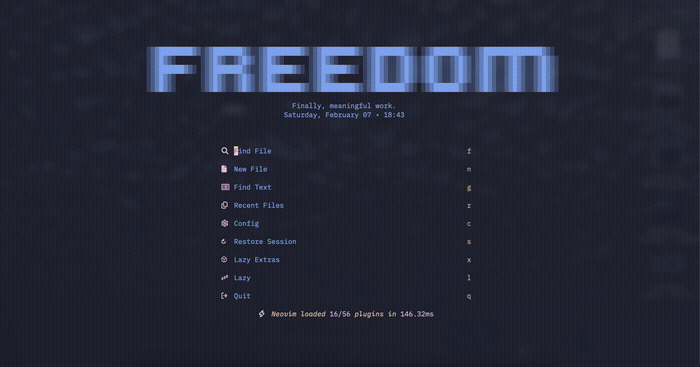
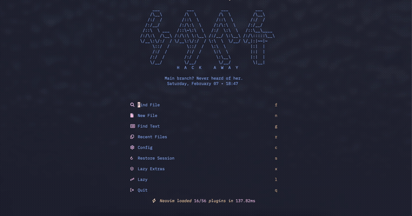
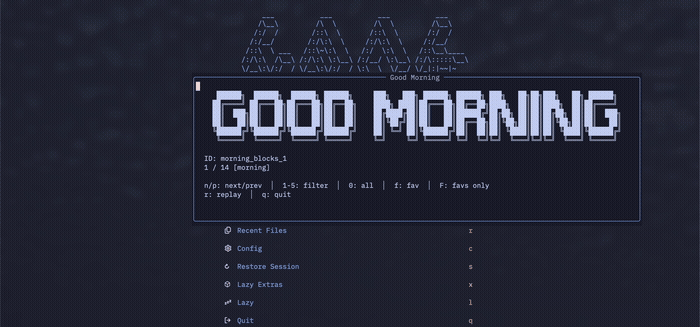
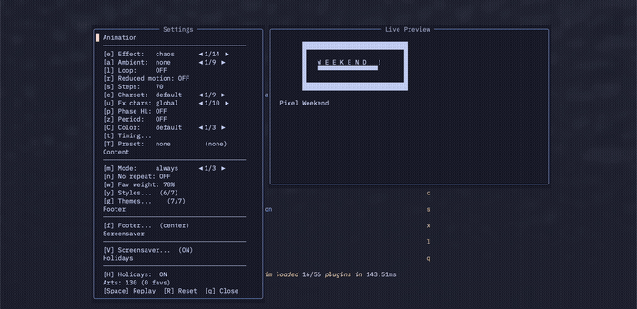
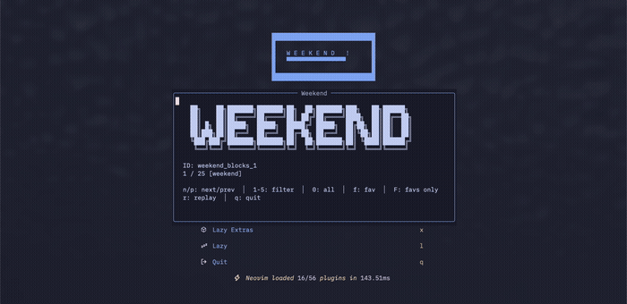
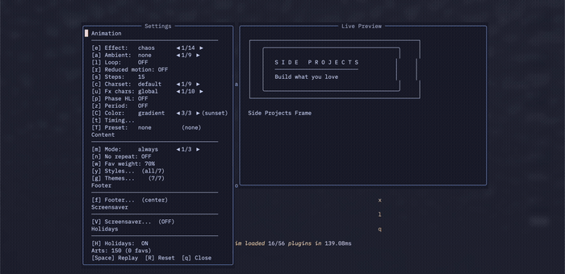
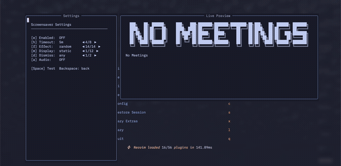

# nvim-ascii-animation

**Cinematic text animation for Neovim dashboards.** Watch your ASCII art materialize from chaos with smooth ease-in-out animation effects — 14 effects, 140+ arts, 8 ambient modes, a screensaver, and full interactivity.

<p align="center">
  
</p>

<p align="center">
  <strong>14 effects</strong> · <strong>140+ ASCII arts</strong> · <strong>7 art styles</strong> · <strong>8 ambient effects</strong> · <strong>13 screensaver modes</strong> · <strong>5 theme presets</strong>
</p>

---

## Features

- **14 animation effects** — chaos, typewriter, diagonal, lines, matrix, wave, fade, scramble, rain, spiral, explode, implode, glitch, and random
- **140+ built-in ASCII arts** in 7 styles — blocks, gradient, isometric, box, minimal, pixel, braille
- **8 ambient effects** — glitch, shimmer, cursor trail, sparkle, scanlines, noise, shake, sound
- **Interactive settings panel** with live preview — change effects, colors, and presets in real time
- **Art preview browser** — browse, favorite, filter, and preview all ASCII arts
- **5 theme presets** — retro, zen, cyberpunk, cinematic, hacker — or create your own
- **Screensaver** with 13 display modes — bounce, tile, marquee, zoom, and audio-reactive modes
- **Color modes** — rainbow palettes, gradient presets, period-based auto-switching
- **9 color themes** — cyberpunk, matrix, ocean, sunset, forest, monochrome, dracula, nord
- **9 character presets** — default, minimal, matrix, blocks, braille, stars, geometric, binary, dots
- **330+ motivational taglines** with 14 personalization placeholders
- **Time-aware content** — morning, afternoon, evening, night, weekend themes
- **Holiday content** — auto-detected seasonal art and messages (5 built-in, user-extensible)
- **Custom effects API** — register your own animation effects
- **Event hooks** — Lua callbacks and autocommands for animation lifecycle
- **Loop mode** with optional reverse playback
- **Reduced motion** mode for accessibility
- **Footer system** with template placeholders and alignment
- **Message system** — multi-line, conditional, favorites, categories, history tracking
- **Daily/session seed** — consistent art selection across restarts
- **Terminal width detection** with automatic fallback
- **13 user commands** with tab completion
- Works with **snacks.nvim**, **alpha-nvim**, **dashboard-nvim**, and **lazy.nvim** starter

---

## Showcase

### Animation Effects

14 distinct effects to reveal your ASCII art. Each creates a unique visual experience.

<p align="center">
  
</p>

| Effect | Description |
|--------|-------------|
| **chaos** | Characters start as random symbols and progressively reveal |
| **typewriter** | Left-to-right sequential reveal with a blinking cursor |
| **diagonal** | Sweep from top-left to bottom-right |
| **lines** | Line-by-line reveal from top to bottom |
| **matrix** | Characters rain down and settle into place |
| **wave** | Circular ripple from a configurable origin point |
| **fade** | Brightness progression with cascading stagger |
| **scramble** | Slot-machine style cycling before settling |
| **rain** | Characters fall and stack from the bottom up |
| **spiral** | Spiral pattern from center or edges |
| **explode** | Radial outward reveal from center |
| **implode** | Collapsing reveal from edges to center |
| **glitch** | Cyberpunk-style digital corruption that stabilizes |
| **random** | Picks a different effect each time |

### ASCII Art Styles

7 art styles with 140+ built-in arts, each with a distinct visual character.

<p align="center">
  
</p>

| Style | Characters | Aesthetic |
|-------|-----------|-----------|
| **Blocks** | `██ ╚═╝ ▓█` | Bold, modern, eye-catching |
| **Gradient** | `░▒▓` | Subtle, sophisticated, flowing |
| **Isometric** | `/\ \| __` | Technical, elegant, architectural |
| **Box** | `─ │ ┌ ┐ └ ┘ ╔ ╗` | Clean, structured frames |
| **Minimal** | whitespace | Zen-like simplicity |
| **Pixel** | `▄█▀░▓` | Retro 8-bit graphics |
| **Braille** | `⣿⠛⣤⠀` | High-resolution fine detail |

### Interactive Settings Panel

`:AsciiSettings` opens a full interactive panel with live preview. Change effects, colors, presets, and see the result instantly.

<p align="center">
  
</p>

### Art Preview Browser

`:AsciiPreview` lets you browse all 140+ ASCII arts, filter by period, favorite your picks, and preview each one with animation.

<p align="center">
  
</p>

### Theme Presets

Apply a complete look with a single command. Each preset bundles style, effect, ambient, charset, and color theme.

<p align="center">
  
</p>

| Preset | Style | Effect | Ambient | Charset | Color Theme |
|--------|-------|--------|---------|---------|-------------|
| **retro** | pixel | matrix | glitch | blocks | — |
| **zen** | minimal | fade | none | minimal | — |
| **cyberpunk** | braille | scramble | glitch | matrix | cyberpunk |
| **cinematic** | gradient | wave | shimmer | default | — |
| **hacker** | blocks | typewriter | scanlines | binary | matrix |

```vim
:AsciiPreset cyberpunk
```

### Color Modes

Three coloring modes — default (single color), rainbow (per-line palette cycling), and gradient (smooth top-to-bottom transition). Plus automatic period-based color switching that adapts to the time of day.

<p align="center">
  
</p>

**Rainbow palettes:** default, pastel, neon, warm, cool, mono
**Gradient presets:** sunset, ocean, forest, fire, purple, pink, midnight, aurora
**Color themes:** default, cyberpunk, matrix, ocean, sunset, forest, monochrome, dracula, nord

### Ambient Effects

After the animation completes, ambient effects add subtle ongoing visual interest.

<p align="center">
  
</p>

| Effect | Description |
|--------|-------------|
| **glitch** | Random characters briefly flicker to chaos |
| **shimmer** | Single characters briefly flash |
| **cursor_trail** | A virtual cursor moves through the art |
| **sparkle** | Random sparkle characters appear |
| **scanlines** | CRT-style horizontal dimmed lines |
| **noise** | Random noise characters replace some chars |
| **shake** | Simulates screen shake by offsetting text |
| **sound** | Plays a sound file at each interval |

### Screensaver

Full-screen animated ASCII art after idle timeout. 13 display modes including audio-reactive modes that pulse with your microphone.

<p align="center">
  
</p>

| Mode | Description |
|------|-------------|
| `static` | Centered art with looping animation |
| `bounce` | Bounces around like a DVD logo |
| `tile` | Repeats in a grid filling the screen |
| `marquee` | Scrolls horizontally |
| `zoom` | Displayed at 2x size |
| `pulse` | Scales between 1x-2x based on audio |
| `waves` | Concentric ripples on sound |
| `rain` | Characters fall like rain |
| `shatter` | Art explodes on sound spikes |
| `fireworks` | Burst explosions around art |
| `heartbeat` | Glowing aura pulses on beats |
| `random` | Randomly picks a mode |

Audio-reactive modes require [sox](https://sox.sourceforge.net/) (`brew install sox` / `apt install sox`).

```vim
:AsciiScreensaver           " Trigger immediately
:AsciiScreensaver on        " Enable idle trigger
```

---

## Installation

### Using [lazy.nvim](https://github.com/folke/lazy.nvim)

```lua
{
  "giuseppesalvi/nvim-ascii-animation",
  event = "VimEnter",
  opts = {},
}
```

That's it. The plugin works out of the box with sensible defaults.

### Customize animation settings

```lua
{
  "giuseppesalvi/nvim-ascii-animation",
  event = "VimEnter",
  opts = {
    animation = {
      effect = "wave",          -- Any of the 14 effects
      ambient = "sparkle",      -- Post-animation ambient effect
      steps = 40,               -- Animation smoothness (10-100)
      loop = false,             -- Continuous replay
      char_preset = "default",  -- Character set for animation
      color_mode = "gradient",  -- "default" | "rainbow" | "gradient"
    },
  },
}
```

---

## Quick Start

### With snacks.nvim

```lua
-- Plugin spec for snacks.nvim
{
  "folke/snacks.nvim",
  opts = function()
    local ascii = require("ascii-animation")
    local header = ascii.get_header()

    return {
      dashboard = {
        preset = {
          header = table.concat(header.art, "\n") .. "\n\n" .. header.message,
        },
      },
    }
  end,
},

-- Animation setup
{
  "giuseppesalvi/nvim-ascii-animation",
  event = "VimEnter",
  config = function()
    require("ascii-animation").setup({
      snacks = { header_lines = 20 },
    })
  end,
}
```

<details>
<summary><strong>With alpha-nvim</strong></summary>

```lua
{
  "giuseppesalvi/nvim-ascii-animation",
  event = "VimEnter",
  config = function()
    require("ascii-animation").setup({
      animation = { steps = 40 },
    })
    require("ascii-animation").setup_alpha({
      header_lines = 15,
      highlight = "AlphaHeader",
    })
  end,
}
```

**Using content system with alpha:**

```lua
{
  "goolord/alpha-nvim",
  config = function()
    local alpha = require("alpha")
    local ascii = require("ascii-animation")
    local header = ascii.get_header()

    local dashboard = require("alpha.themes.dashboard")
    dashboard.section.header.val = header.art
    dashboard.section.footer.val = header.message

    alpha.setup(dashboard.config)
  end,
}
```

</details>

<details>
<summary><strong>With dashboard-nvim</strong></summary>

```lua
{
  "giuseppesalvi/nvim-ascii-animation",
  event = "VimEnter",
  config = function()
    require("ascii-animation").setup({
      animation = { steps = 40 },
    })
    require("ascii-animation").setup_dashboard({
      header_lines = 15,
      highlight = "DashboardHeader",
    })
  end,
}
```

</details>

<details>
<summary><strong>With lazy.nvim starter screen</strong></summary>

```lua
{
  "giuseppesalvi/nvim-ascii-animation",
  event = "VimEnter",
  config = function()
    require("ascii-animation").setup({
      animation = { steps = 40 },
    })
    require("ascii-animation").setup_lazy({
      header_lines = 15,
      highlight = "LazyH1",
    })
  end,
}
```

</details>

---

## Commands

| Command | Description |
|---------|-------------|
| `:AsciiSettings` | Interactive settings panel with live preview |
| `:AsciiPreview [name]` | Browse and preview ASCII arts in a floating window |
| `:AsciiEffect [name]` | Set or view the current animation effect (tab completion) |
| `:AsciiPreset [name]` | Apply a theme preset (tab completion) |
| `:AsciiNext` | Cycle to the next animation effect |
| `:AsciiRefresh` | Re-run animation on the current buffer |
| `:AsciiRestart` | Restart animation from the beginning |
| `:AsciiStop` | Stop animation and ambient effects |
| `:AsciiPause` | Pause animation at the current frame |
| `:AsciiResume` | Resume a paused animation |
| `:AsciiCharset [preset]` | Change or view the character set preset |
| `:AsciiScreensaver [on\|off]` | Toggle or trigger the screensaver |
| `:checkhealth ascii-animation` | Run diagnostics |

<details>
<summary><strong>AsciiSettings keybindings</strong></summary>

**Main Menu:**

| Key | Action |
|-----|--------|
| `e` / `E` | Cycle effect forward/backward (14 effects) |
| `o` | Open effect-specific options (wave, glitch, scramble, spiral, fade) |
| `a` / `A` | Cycle ambient effect (9 options) |
| `l` | Toggle loop mode |
| `r` | Toggle reduced motion |
| `s` / `S` | Adjust steps (±5) |
| `c` | Cycle charset preset (9 presets) |
| `p` | Toggle phase highlights |
| `z` | Toggle period-based colors |
| `P` | Open phase colors submenu |
| `C` | Open color mode settings |
| `t` | Open timing settings |
| `T` | Cycle theme preset |
| `m` / `M` | Cycle random mode (always/daily/session) |
| `n` | Toggle no-repeat |
| `w` / `W` | Adjust favorites weight (±10%) |
| `y` | Open styles filter |
| `g` | Open themes/messages settings |
| `f` | Open footer settings |
| `V` | Open screensaver settings |
| `H` | Toggle holidays |
| `Space` | Replay preview animation |
| `R` | Reset to defaults |
| `q` / `Esc` | Close |

**Effect Options (press `o`):**

*Wave:* `o`/`O` cycle origin, `s`/`S` adjust speed
*Glitch:* `i`/`I` intensity, `b`/`B` block chance, `s`/`S` block size, `r` resolve speed
*Scramble:* `s`/`S` cycle stagger, `c`/`C` adjust cycles
*Spiral:* `d`/`D` cycle direction, `r` rotation, `t`/`T` tightness
*Fade:* `h`/`H` highlight levels

**Timing (press `t`):** `m`/`M` min delay, `x`/`X` max delay, `d`/`D` loop delay, `v` loop reverse, `i`/`I` ambient interval

**Phase Colors (press `P`):** `T` cycle theme, `1`-`5` edit individual colors, `r` reset

**Color Mode (press `C`):** `m`/`M` cycle mode, `p` rainbow palette, `g` gradient preset, `1`/`2` custom colors

**Styles (press `y`):** `1`-`7` toggle individual styles

**Themes (press `g`):** `1`-`7` toggle themes, `b` message browser

**Message Browser:** `j`/`k` navigate, `n`/`N` page, `1`-`5` filter by period, `F` favorite, `d` disable, `p` preview

**Footer (press `f`):** `e` toggle, `a`/`A` alignment, `t` edit template

</details>

<details>
<summary><strong>AsciiPreview keybindings</strong></summary>

| Key | Action |
|-----|--------|
| `n` / `p` or `j` / `k` | Next/previous art |
| `1`-`5` | Filter by period (morning, afternoon, evening, night, weekend) |
| `0` | Show all arts |
| `f` | Toggle favorite |
| `F` | Show favorites only |
| `r` | Replay animation |
| `q` | Close |

</details>

---

## Configuration

<details>
<summary><strong>Full configuration example</strong></summary>

```lua
{
  "giuseppesalvi/nvim-ascii-animation",
  event = "VimEnter",
  opts = {
    animation = {
      enabled = true,
      -- Effect: "chaos" | "typewriter" | "diagonal" | "lines" | "matrix" | "wave" |
      --         "fade" | "scramble" | "rain" | "spiral" | "explode" | "implode" | "glitch" | "random"
      effect = "chaos",
      effect_options = {
        -- Wave
        origin = "center",  -- "center" | "top-left" | "top-right" | "bottom-left" | "bottom-right" | "top" | "bottom" | "left" | "right"
        speed = 1.0,
        -- Glitch
        glitch = {
          intensity = 0.5,
          block_chance = 0.2,
          block_size = 5,
          resolve_speed = 1.0,
        },
        -- Scramble
        stagger = "left",   -- "left" | "right" | "center" | "random"
        cycles = 5,
        -- Spiral
        direction = "outward",   -- "outward" | "inward"
        rotation = "clockwise",  -- "clockwise" | "counter"
        tightness = 1.0,
        -- Fade
        highlight_count = 10,
      },
      steps = 40,
      min_delay = 20,
      max_delay = 120,
      -- Loop
      loop = false,
      loop_delay = 2000,
      loop_reverse = false,
      -- Ambient
      ambient = "none",  -- "none" | "glitch" | "shimmer" | "cursor_trail" | "sparkle" | "scanlines" | "noise" | "shake" | "sound"
      ambient_interval = 2000,
      ambient_options = {
        cursor_trail = { trail_chars = "▓▒░", trail_length = 3, move_speed = 1 },
        sparkle = { chars = "✦✧★·", density = 0.05 },
        scanlines = { spacing = 2, dim_amount = 0.5 },
        noise = { intensity = 0.1 },
        shake = { max_offset = 2, line_probability = 0.3 },
        sound = { file_path = nil, volume = 50 },
      },
      -- Characters
      char_preset = "default",  -- "default" | "minimal" | "matrix" | "blocks" | "braille" | "stars" | "geometric" | "binary" | "dots"
      effect_chars = {},         -- Per-effect charset overrides: { matrix = "matrix", rain = "│┃┆┇┊┋" }
      -- Highlighting
      use_phase_highlights = false,
      color_theme = nil,    -- "default" | "cyberpunk" | "matrix" | "ocean" | "sunset" | "forest" | "monochrome" | "dracula" | "nord"
      color_mode = "default",  -- "default" | "rainbow" | "gradient"
      rainbow = { palette = "default" },  -- "default" | "pastel" | "neon" | "warm" | "cool" | "mono"
      gradient = { preset = "sunset" },   -- "sunset" | "ocean" | "forest" | "fire" | "purple" | "pink" | "midnight" | "aurora"
      period_colors = false,
      period_color_overrides = {},
      -- Accessibility
      reduced_motion = false,
      -- Terminal
      auto_fit = false,
      min_width = 60,
      fallback = "tagline",
    },
    chaos_chars = "@#$%&*+=-:;!?/\\|[]{}()<>~`'^",
    header = { padding = 3 },

    content = {
      enabled = true,
      builtin_arts = true,
      builtin_messages = true,
      styles = nil,  -- or {"blocks", "gradient", "isometric", "box", "minimal", "pixel", "braille"}
      time_periods = {
        morning   = { start = 5,  stop = 12 },
        afternoon = { start = 12, stop = 17 },
        evening   = { start = 17, stop = 21 },
        night     = { start = 21, stop = 5 },
      },
      weekend_override = true,
      placeholders = { name = "Developer" },
      random = "always",       -- "always" | "daily" | "session"
      favorites = {},
      favorite_weight = 2,
      no_repeat = 5,
      message_no_repeat = 5,
      message_categories = nil,
      exclude_categories = nil,
      custom_arts = {},
      custom_messages = {},
      custom_presets = {},
      holidays = {
        enabled = true,
        priority = 3,
        custom = {},
      },
    },

    footer = {
      enabled = true,
      template = "{message}",
      alignment = "center",
    },

    screensaver = {
      enabled = false,
      timeout = 300000,   -- 5 minutes
      effect = "random",
      display = "static", -- "static" | "bounce" | "tile" | "marquee" | "zoom" | "pulse" | "waves" | "rain" | "shatter" | "fireworks" | "heartbeat" | "random"
      dismiss = "any",
      audio_reactive = false,
    },

    hooks = {
      on_animation_start = nil,
      on_animation_complete = nil,
      on_loop = nil,
      on_effect_change = nil,
    },
  },
}
```

</details>

<details>
<summary><strong>Animation options reference</strong></summary>

| Option | Type | Default | Description |
|--------|------|---------|-------------|
| `animation.enabled` | boolean | `true` | Enable/disable animation |
| `animation.effect` | string | `"chaos"` | Animation effect |
| `animation.steps` | number | `40` | Total animation steps (more = smoother) |
| `animation.min_delay` | number | `20` | Fastest frame delay in ms |
| `animation.max_delay` | number | `120` | Slowest frame delay in ms |
| `animation.loop` | boolean | `false` | Enable loop mode |
| `animation.loop_delay` | number | `2000` | Delay between loops in ms |
| `animation.loop_reverse` | boolean | `false` | Play reverse before next loop |
| `animation.ambient` | string | `"none"` | Ambient effect after animation completes |
| `animation.ambient_interval` | number | `2000` | Ambient trigger interval in ms |
| `animation.char_preset` | string | `"default"` | Character set preset |
| `animation.effect_chars` | table | `{}` | Per-effect charset overrides |
| `animation.use_phase_highlights` | boolean | `false` | Enable phase-based highlight groups |
| `animation.color_theme` | string | `nil` | Color theme (auto-enables phase highlights) |
| `animation.color_mode` | string | `"default"` | Line coloring mode |
| `animation.rainbow.palette` | string | `"default"` | Rainbow palette |
| `animation.gradient.preset` | string | `"sunset"` | Gradient preset |
| `animation.gradient.start` | string | `nil` | Custom gradient start color (hex) |
| `animation.gradient.stop` | string | `nil` | Custom gradient stop color (hex) |
| `animation.period_colors` | boolean | `false` | Auto-switch colors by time of day |
| `animation.period_color_overrides` | table | `{}` | Override specific period colors |
| `animation.reduced_motion` | boolean | `false` | Skip animation, show final art |
| `animation.auto_fit` | boolean | `false` | Skip arts wider than terminal |
| `animation.min_width` | number | `60` | Minimum terminal width |
| `animation.fallback` | string | `"tagline"` | Fallback when terminal too narrow |
| `chaos_chars` | string | `"@#$%&*..."` | Custom chaos characters |
| `header.padding` | number | `3` | Extra lines after header |

**Effect-specific options** (`animation.effect_options`):

| Option | Type | Default | For Effect |
|--------|------|---------|------------|
| `origin` | string | `"center"` | wave |
| `speed` | number | `1.0` | wave |
| `glitch.intensity` | number | `0.5` | glitch |
| `glitch.block_chance` | number | `0.2` | glitch |
| `glitch.block_size` | number | `5` | glitch |
| `glitch.resolve_speed` | number | `1.0` | glitch |
| `stagger` | string | `"left"` | scramble |
| `cycles` | number | `5` | scramble |
| `direction` | string | `"outward"` | spiral |
| `rotation` | string | `"clockwise"` | spiral |
| `tightness` | number | `1.0` | spiral |
| `highlight_count` | number | `10` | fade |

</details>

<details>
<summary><strong>Content options reference</strong></summary>

| Option | Type | Default | Description |
|--------|------|---------|-------------|
| `content.enabled` | boolean | `true` | Enable content system |
| `content.builtin_arts` | boolean | `true` | Use built-in ASCII arts |
| `content.builtin_messages` | boolean | `true` | Use built-in taglines |
| `content.styles` | table/nil | `nil` | Filter art styles |
| `content.weekend_override` | boolean | `true` | Use weekend content on Sat/Sun |
| `content.placeholders` | table | `{}` | Override placeholder values |
| `content.random` | string | `"always"` | Randomization: `"always"` / `"daily"` / `"session"` |
| `content.favorites` | table | `{}` | Art IDs for higher selection probability |
| `content.favorite_weight` | number | `2` | Multiplier for favorites |
| `content.no_repeat` | bool/number | `false` | Don't repeat last N arts |
| `content.message_no_repeat` | bool/number | `false` | Don't repeat last N messages |
| `content.message_categories` | table/nil | `nil` | Include-list for message themes |
| `content.exclude_categories` | table/nil | `nil` | Exclude-list for message themes |
| `content.custom_arts` | table | `{}` | User-defined arts by period |
| `content.custom_messages` | table | `{}` | User-defined messages by period |
| `content.custom_presets` | table | `{}` | User-defined theme presets |
| `content.preset` | string/nil | `nil` | Active theme preset name |

</details>

<details>
<summary><strong>Screensaver options reference</strong></summary>

| Option | Type | Default | Description |
|--------|------|---------|-------------|
| `screensaver.enabled` | boolean | `false` | Enable idle screensaver |
| `screensaver.timeout` | number | `300000` | Idle timeout in ms (default: 5 min) |
| `screensaver.effect` | string | `"random"` | Animation effect for reveal |
| `screensaver.display` | string | `"static"` | Display mode |
| `screensaver.dismiss` | string | `"any"` | Dismiss trigger: `"any"` or `"escape"` |
| `screensaver.audio_reactive` | boolean | `false` | Pulse with microphone (requires sox) |

</details>

<details>
<summary><strong>Footer options reference</strong></summary>

| Option | Type | Default | Description |
|--------|------|---------|-------------|
| `footer.enabled` | boolean | `true` | Enable/disable footer |
| `footer.template` | string | `"{message}"` | Template with placeholders |
| `footer.alignment` | string | `"center"` | `"left"` / `"center"` / `"right"` |

Available placeholders: `{message}`, `{date}`, `{time}`, `{version}`, `{plugins}`, `{name}`, `{project}`

</details>

<details>
<summary><strong>Holiday options reference</strong></summary>

| Option | Type | Default | Description |
|--------|------|---------|-------------|
| `content.holidays.enabled` | boolean | `true` | Enable holiday content |
| `content.holidays.priority` | number | `3` | Weight multiplier for holiday content |
| `content.holidays.custom` | table | `{}` | User-defined holidays |

**Built-in holidays:** New Year's Day (Jan 1), Valentine's Day (Feb 14), Halloween (Oct 31), Christmas (Dec 24-26), New Year's Eve (Dec 31).

```lua
content = {
  holidays = {
    custom = {
      { name = "birthday", month = 3, day = 15, message = "Happy Birthday!" },
      { name = "pi_day", month = 3, day = 14, message = "Happy Pi Day! 3.14159..." },
      { name = "festival", from = { month = 7, day = 1 }, to = { month = 7, day = 4 } },
    },
  },
}
```

</details>

<details>
<summary><strong>Hooks options reference</strong></summary>

| Option | Type | Default | Description |
|--------|------|---------|-------------|
| `hooks.on_animation_start` | function/nil | `nil` | Called when animation begins. Args: `(effect)` |
| `hooks.on_animation_complete` | function/nil | `nil` | Called when animation finishes. Args: `(effect)` |
| `hooks.on_loop` | function/nil | `nil` | Called at start of each loop. Args: `(loop_count)` |
| `hooks.on_effect_change` | function/nil | `nil` | Called when effect changes. Args: `(old_effect, new_effect)` |

</details>

---

## Content System

The plugin includes **140+ ASCII arts** and **330+ taglines** that automatically adapt to the time of day.

### Time Periods

| Period | Default Hours | Theme |
|--------|--------------|-------|
| Morning | 5:00 - 12:00 | Fresh starts, energy, coffee |
| Afternoon | 12:00 - 17:00 | Focus, momentum, productivity |
| Evening | 17:00 - 21:00 | Wind down, reflection, golden hour |
| Night | 21:00 - 5:00 | Deep work, silence, moonlight |
| Weekend | Sat & Sun | Freedom, side projects, no meetings |

### Personalization Placeholders

Taglines support 14 placeholder tokens that get replaced at render time:

| Placeholder | Description | Example |
|-------------|-------------|---------|
| `{name}` | User's name (from git config) | "John" |
| `{project}` | Current project name | "my-project" |
| `{time}` | Time-based period | "morning" |
| `{date}` | Current date | "February 07, 2026" |
| `{version}` | Neovim version | "v0.10.0" |
| `{plugin_count}` | Loaded plugins count | "42" |
| `{day}` | Day of the week | "Friday" |
| `{hour}` | Current hour (12h) | "9 AM" |
| `{greeting}` | Natural greeting | "Good morning" |
| `{git_branch}` | Current git branch | "feat/new-feature" |
| `{uptime}` | Session uptime | "1h 23m" |
| `{streak}` | Consecutive usage days | "3" |
| `{random_emoji}` | Session-stable emoji | random themed pick |

```lua
-- Built-in examples
"Good {time}, {name}!"           --> "Good morning, John!"
"Welcome back to {project}."     --> "Welcome back to my-project."
"{greeting}, {name}!"            --> "Good afternoon, John!"
"Working on {git_branch}?"       --> "Working on feat/new-feature?"
"{streak} day streak!"           --> "3 day streak!"
```

<details>
<summary><strong>Message features</strong></summary>

#### Multi-line Messages

```lua
-- Built-in haiku example
{ text = { "Morning light awaits.", "Empty buffer, fresh mind.", "Code flows like water." }, theme = "zen" }

-- In config
custom_messages = {
  morning = {
    { "First line.", "Second line." },
    { text = { "With theme:", "And lines." }, theme = "poetic" },
  },
}
```

#### Conditional Messages

```lua
-- Built-in examples
{ text = "Happy Friday!", theme = "witty", condition = function() return os.date("%A") == "Friday" end }
{ text = "Late night coding?", theme = "zen", condition = function() return tonumber(os.date("%H")) >= 23 end }
```

#### Message Categories

Available themes: Motivational, Personalized, Philosophical, Cryptic, Poetic, Zen, Witty

```lua
content = {
  message_categories = { "zen", "witty" },   -- Only these themes
  -- or
  exclude_categories = { "cryptic" },         -- All except these
}
```

#### Message Favorites & History

Favorite messages appear 3x more often. Manage via `:AsciiSettings` → `g` → `b` (Message Browser), then press `F` on any message.

```lua
content = {
  message_no_repeat = 5,  -- Don't repeat any of the last 5 messages
}
```

</details>

### Using Footer with snacks.nvim

```lua
{
  "folke/snacks.nvim",
  opts = function()
    local ascii = require("ascii-animation")
    local header = ascii.get_header()
    local footer_lines = ascii.get_footer_lines()

    return {
      dashboard = {
        preset = { header = table.concat(header.art, "\n") },
        sections = {
          { section = "header" },
          -- ... your menu items ...
          { section = "startup" },
          { text = footer_lines, align = "center" },
        },
      },
    }
  end,
},

{
  "giuseppesalvi/nvim-ascii-animation",
  event = "VimEnter",
  config = function()
    require("ascii-animation").setup({
      footer = {
        enabled = true,
        template = "{message} • {date}",
        alignment = "center",
      },
      snacks = { header_lines = 20 },
    })
  end,
}
```

---

## Custom Effects

Register your own animation effects that integrate with `:AsciiEffect`, `:AsciiSettings`, and tab completion:

```lua
local ascii = require("ascii-animation")

ascii.register_effect("dissolve", {
  -- Required: transform(line, reveal_ratio, line_idx, total_lines, opts)
  -- reveal_ratio goes from 0 (hidden) to 1 (fully revealed)
  transform = function(line, reveal_ratio, line_idx, total_lines, opts)
    if reveal_ratio >= 1 then return line end
    local chars = vim.fn.split(line, "\\zs")
    local result = {}
    for i, char in ipairs(chars) do
      if char == " " or math.random() < reveal_ratio then
        table.insert(result, char)
      else
        table.insert(result, opts.random_char())
      end
    end
    return table.concat(result)
  end,
  -- Optional: custom timing (return delay in ms)
  get_delay = function(step, total_steps)
    return 30
  end,
})

-- Now use it like any built-in effect:
-- :AsciiEffect dissolve
-- ascii.set_effect("dissolve")
```

**Helper utilities** available in `opts`: `opts.random_char()`, `opts.ease_in_out(t)`, `opts.clamp(value, min, max)`

Custom effects are wrapped in `pcall` — errors fall back to the original line, never crashing the animation.

---

## Event Hooks

React to animation lifecycle events via Lua callbacks or Neovim autocommands:

```lua
require("ascii-animation").setup({
  hooks = {
    on_animation_start = function(effect)
      print("Animation started: " .. effect)
    end,
    on_animation_complete = function(effect)
      print("Animation finished: " .. effect)
    end,
    on_loop = function(loop_count)
      print("Loop #" .. loop_count)
    end,
    on_effect_change = function(old_effect, new_effect)
      print(old_effect .. " -> " .. new_effect)
    end,
  },
})
```

**Autocommands:**

```vim
autocmd User AsciiAnimationStart echo "Animation started!"
autocmd User AsciiAnimationComplete echo "Animation complete!"
autocmd User AsciiAnimationLoop echo "Animation looped!"
autocmd User AsciiEffectChange echo "Effect changed!"
```

Hook errors are caught with `pcall` — they won't break the animation.

---

## Highlight Groups

When `use_phase_highlights` is enabled (or a `color_theme` is set), the animation uses dedicated highlight groups for different character states:

| Highlight Group | Default | Description |
|-----------------|---------|-------------|
| `AsciiAnimationChaos` | `#555555` | Unrevealed chaos characters |
| `AsciiAnimationRevealing` | `#888888` | Characters about to reveal |
| `AsciiAnimationRevealed` | `#ffffff` | Fully revealed characters |
| `AsciiAnimationCursor` | `#00ff00` bold | Typewriter cursor |
| `AsciiAnimationGlitch` | `#ff0055` | Glitch effect corruption |

Customize in your config:

```lua
vim.api.nvim_set_hl(0, "AsciiAnimationChaos", { fg = "#1a1a2e" })
vim.api.nvim_set_hl(0, "AsciiAnimationRevealing", { fg = "#4a4a6a" })
vim.api.nvim_set_hl(0, "AsciiAnimationRevealed", { link = "Title" })
vim.api.nvim_set_hl(0, "AsciiAnimationCursor", { fg = "#00ff41", bold = true })
vim.api.nvim_set_hl(0, "AsciiAnimationGlitch", { fg = "#ff0066", bold = true })
```

### Period-Based Color Schemes

Automatically apply different colors based on time of day:

```lua
animation = {
  period_colors = true,
}
```

| Period | Chaos | Revealing | Revealed | Mood |
|--------|-------|-----------|----------|------|
| Morning | `#1a0a00` | `#ff9500` | `#ffcc00` | warm |
| Afternoon | `#001a1a` | `#00aa88` | `#00ffcc` | teal |
| Evening | `#0a0015` | `#ff6b9d` | `#ffa07a` | soft |
| Night | `#0a0a1a` | `#6666ff` | `#aaaaff` | cool |
| Weekend | `#0a1a0a` | `#66ff66` | `#aaffaa` | fresh |

---

## API

<details>
<summary><strong>Content API</strong></summary>

```lua
local ascii = require("ascii-animation")

-- Get complete header for current time period
local header = ascii.get_header()
-- Returns: { art = {...}, message = "...", footer = "...", period = "...", art_id = "...", art_name = "..." }

-- Get rendered footer
local footer = ascii.get_footer()               -- "Rise and shine! • February 07, 2026"
local footer_lines = ascii.get_footer_lines(80)  -- Aligned for dashboard

-- Current period
ascii.get_current_period()  -- "morning" | "afternoon" | "evening" | "night" | "weekend"

-- Art selection
local art = ascii.get_art()                       -- Random art for current period
ascii.get_art_for_period("evening")               -- Art for specific period
ascii.get_art_by_id("morning_blocks_1")           -- Specific art by ID
ascii.list_arts()                                 -- All art IDs
ascii.list_arts_for_period("morning")             -- Art IDs for period
ascii.get_styles()                                -- Available style names

-- Message selection
local message = ascii.get_message()               -- Random message for current period
ascii.get_message_for_period("night")             -- Message for specific period

-- Period-specific header
ascii.get_header_for_period("weekend")
```

</details>

<details>
<summary><strong>Animation control API</strong></summary>

```lua
local ascii = require("ascii-animation")

-- Animation control
ascii.animate_buffer()                    -- Animate current buffer
ascii.animate_buffer(bufnr, lines, hl)   -- Animate specific buffer
ascii.stop()                              -- Stop animation + ambient
ascii.pause()                             -- Pause at current frame
ascii.resume()                            -- Resume paused animation
ascii.refresh()                           -- Re-run animation

-- Effect management
ascii.next_effect()                       -- Cycle to next effect (returns name)
ascii.set_effect("wave")                  -- Set specific effect (returns bool)
ascii.register_effect("name", { ... })    -- Register custom effect (returns bool)

-- Presets
ascii.apply_preset("retro")              -- Apply theme preset (returns bool)
ascii.list_presets()                      -- List all preset names

-- Commands
ascii.preview("morning_blocks_1")        -- Preview art in floating window
ascii.settings()                         -- Open settings panel

-- Screensaver
ascii.screensaver()                      -- Trigger screensaver
ascii.dismiss_screensaver()              -- Dismiss active screensaver

-- Holidays
ascii.is_holiday()                       -- Check if today is a holiday
ascii.get_active_holidays()              -- Get active holiday names
```

</details>

<details>
<summary><strong>Placeholders API</strong></summary>

```lua
local placeholders = require("ascii-animation").placeholders

-- Process strings with placeholders
placeholders.process("Hello, {name}!")                -- "Hello, John!"
placeholders.process({ "Line 1", "{name}" })          -- { "Line 1", "John" }

-- Utilities
placeholders.is_multiline({ "A", "B" })               -- true
placeholders.flatten({ "A", "B" })                     -- "A\nB"
placeholders.flatten({ "A", "B" }, " • ")              -- "A • B"

-- Resolve individual placeholders
placeholders.resolve("name")                           -- "John"
placeholders.resolve("version")                        -- "v0.10.0"
placeholders.list_placeholders()                       -- { "name", "project", ... }
placeholders.clear_cache()                             -- Clear cached values
```

</details>

<details>
<summary><strong>Advanced usage</strong></summary>

```lua
-- Direct module access
local animation = require("ascii-animation").animation
local config = require("ascii-animation").config
local content = require("ascii-animation").content
local time = require("ascii-animation").time

-- Use individual animation functions
local chaotic = animation.chaos_line("Hello World", 0.5)  -- 50% revealed
local delay = animation.get_frame_delay(10, 40)            -- Frame 10 of 40

-- Start animation with full control
animation.start(buf, header_lines, highlight)
```

</details>

---

## How It Works

All effects use Neovim's extmarks with virtual text overlay, preserving your original buffer content and highlights.

<details>
<summary><strong>Effect details</strong></summary>

**Chaos** (default) — Text starts as random characters. Characters progressively reveal using an ease-in-out curve. Frame delays vary from slow (edges) to fast (middle) for cinematic pacing.

**Typewriter** — Characters reveal left-to-right with a cursor (`▌`) at the typing position. Unrevealed characters are hidden.

**Diagonal** — Reveal sweeps from top-left to bottom-right. Top lines reveal before bottom, creating a diagonal wave.

**Lines** — Each line reveals one at a time from top to bottom. The current line uses chaos effect while revealing.

**Matrix** — Characters "fall" and settle into place. Each character has unique timing based on position, using matrix-style symbols.

**Wave** — Characters reveal in an expanding circular pattern from a configurable origin. Creates organic water-like ripples using euclidean distance.

**Fade** — Text fades from dim to bright using dynamic highlight groups. Top lines fade first, creating a cascading brightness wave. Adjust `highlight_count` (5-20) for smoother transitions.

**Scramble** — Characters cycle through random symbols (slot-machine style) before settling. Stagger direction controls settling order.

**Rain** — Characters rain down and stack from the bottom. Each column has unique timing for a natural rain feel.

**Spiral** — Characters reveal in a spiral pattern. Choose direction (outward/inward), rotation (clockwise/counter), and tightness (0.5-2.0).

**Explode** — Radial outward reveal from center. Creates expanding ring pattern with fast middle, slowing at edges.

**Implode** — Reverse of explode — characters reveal from edges inward, creating a converging collapse toward center.

**Glitch** — Characters progressively stabilize through digital corruption. Random rectangular areas show corrupted characters with varied error colors.

**Random** — Randomly selects from the 13 other effects. When looping, picks a new effect for each cycle.

</details>

---

## Credits

Inspired by the "decryption" text effects seen in movies and games.

## License

MIT
